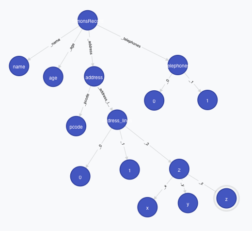

json2neo4j
==========

A node.js based route to neo4j providing a REST interface that persists json documents as a group of neo4j nodes and relationships

## Background

While neo4j has support for json, it is restricted to simple key:value pairs of string, number and arrays of string or number.
nodejs acts as a front-end to neo4j to present a RESTful interface to neo4j.
By POSTing a json string to the node.js route, the json structure is represented in neo4j as a group of nodes and relationships.
GETting this group re-creates the original json.

## Example

The following json file,

```
test = {
    "name":"simon",
    "age": 104,
    "address":{ "pcode":"bee",
      "address_lines":["one","two",{"x":'X',"y":23,"z":"zed"}]
    },
    "telephones":["01234-","09877-"]
}
```

is created in neo4j as the network set out below:



## API

### Create a json Document

|------|:--------------------------------------------------------------------------------------------------|
| url | http://yourserver:yourport/jdoc |
| http | POST |
| Action |On POSTing a JSON string, the endpoint returns an _id which can be used in subsequent places where the API requires {:id} |
| Parameters | none |
| Example Request | |
## Progress

2014-07-03:

Generating basic 'create' statements prior to POST via a cypher query
